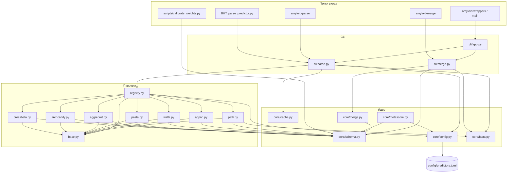

# amyloid_wrappers — обзор структуры и изменений

Пакет на уровне `Amyloids_data/amyloid_wrappers/` (рядом с `BHT_amyloid/`).

**Phase 0** — парсинг сырых выходов и merge в единую схему.  
**Phase 1** (текущая) — `legacy/` с копиями BHT-скриптов, отказ от `*_all.csv`, runners PATH/APPNN.

---

## Phase 1 (2026-07) — кратко

| Изменение | Rationale |
|-----------|-----------|
| `legacy/` | Копии BHT-скриптов внутри пакета; runners ссылаются на `legacy/appnn_converter.R`, не на внешний репозиторий |
| Единый wide-формат | `position`, `aa_name`, `{Tool}_score/bin` — без `--legacy` и колонки `aa`=длина |
| `runners/` + `amyloid-run` | PATH (`path1.1py`) и APPNN (Rscript) end-to-end; `--skip-run` для тестов без запуска PATH |
| `[runners.*]` в TOML | Пути к внешним инструментам и timeout без правки кода |

---

## 1. Дерево каталогов

```
amyloid_wrappers/
├── config/
│   └── predictors.toml          # веса, пороги, cache, runners
├── legacy/                      # frozen BHT reference scripts
│   ├── path_converter.py
│   ├── appnn_converter.R
│   ├── arch_cross_pasta_aggreprot_waltz_parser.ipynb
│   ├── parse_predictor.py
│   └── api/                     # Selenium runners (Phase 2–3)
├── scripts/
│   └── calibrate_weights.py
├── src/amyloid_wrappers/
│   ├── cli/                     # app, parse, merge, run
│   ├── core/
│   ├── predictors/
│   └── runners/                 # PATH, APPNN (Phase 1)
└── tests/
```

### Entry points (`pyproject.toml`)

| Команда | Модуль |
|---------|--------|
| `amyloid-wrappers` | `cli/app.py:main` |
| `amyloid-parse` | `cli/parse.py:main` |
| `amyloid-merge` | `cli/merge.py:main` |
| `amyloid-run` | `cli/run.py:main` |
| `python -m amyloid_wrappers` | `__main__.py` → `app.main` |

---

## 2. Дерево зависимостей



### Типичный пайплайн данных

```
FASTA + raw output
    → amyloid-parse (cli/parse.py)
        → predictors/*.py → PredictorResult
        → standard CSV + cache/
    → amyloid-merge (cli/merge.py)
        → core/merge.py
        → wide.csv  или  legacy *_all.csv
    → (Phase 5) core/metascore.py + calibrate_weights.py
```

---

## 3. Происхождение кода (откуда взят)

| Модуль в `amyloid_wrappers` | Источник в `BHT_amyloid/` | Что перенесено |
|-----------------------------|---------------------------|----------------|
| `predictors/waltz.py` | `arch_cross_pasta_aggreprot_waltz_parser.ipynb` → `analyze_output_waltz` | TSV `.dat`, бинаризация `score != 0` |
| `predictors/pasta.py` | тот же notebook → `analyze_output_pasta` | энергии построчно, порог `< -5` |
| `predictors/aggreprot.py` | notebook → `analyze_output_aggreprot` | CSV с `header=1`, drop лишних колонок, порог `≥ 0.25` |
| `predictors/archcandy.py` | notebook → `analyze_output_archcandy` | регионы Start/Stop/Score → per-residue |
| `predictors/crossbeta.py` | notebook → `analyze_output_crossbeta` | JSON CRBM, `AA_list`, `mean_confidence` |
| `predictors/path.py` | `path_converter.py` → `BatchPATHProcessor._load_path_results`, `_process_single_protein` (скользящее окно 6-mer, нормализация DOPE, percentile threshold) | **Только** per-residue score + bin; APR-экспорт и batch остались в legacy-скрипте |
| `predictors/appnn.py` | `appnn_converter.R` (выходной CSV, не сам R-runner) | колонки position/score/hotspot, порог 0.5 |
| `core/schema.py` | `all/RPS2_human_all.csv` и аналоги | имена колонок `{Tool}_score`, `{Tool}_bin`; `aggrescan` зарегистрирован, парсера нет |
| `core/merge.py` | `all/*_all.csv` + `all/visualize.py` | legacy: 0-based index, колонка `aa` = длина последовательности |
| `core/fasta.py` | `path_converter.py` → `FASTAParser.parse` | упрощённый парсер + валидация 20 стандартных а.к. |
| `core/metascore.py` | `metascores/*_metascore_table.csv`, логика hackathon | линейная взвешенная сумма (Phase 5) |
| `scripts/calibrate_weights.py` | нет прямого аналога | least squares по `all/` vs `metascores/` |
| `cli/parse.py`, `cli/merge.py` | notebook (ручные вызовы) + ad-hoc скрипты | единый CLI |
| `BHT_amyloid/scripts/parse_predictor.py` | notebook | thin wrapper → `amyloid-parse` |

### Пока не перенесено в wrappers (Phase 1–3)

| Файл в `BHT_amyloid/` | Роль |
|-----------------------|------|
| `api/aggreprot.py`, `api/cross_candy.py`, `api/PASTA 2.0.py` | Selenium-runners (скачивание raw) |
| `appnn_converter.R` | запуск APPNN + CSV |
| `path_converter.py` (полностью) | batch PATH + APR/statistics export |
| `all/visualize.py`, `wilcoxon.py` | downstream-анализ |
| `AGGRESSOR.py` | отдельный инструмент мутагенеза |

---

## 4. Функциональное назначение модулей

### CLI

| Файл | Назначение |
|------|------------|
| `cli/app.py` | Корневая `--help`, `--version`, dispatch `parse` / `merge` |
| `cli/parse.py` | `amyloid-parse PREDICTOR`: raw → standard CSV, кэш, пороги из TOML |
| `cli/merge.py` | `amyloid-merge`: несколько standard CSV → wide или `--legacy *_all.csv` |

### Ядро (`core/`)

| Файл | Назначение |
|------|------------|
| `schema.py` | `PredictorSpec`, `PredictorResult`, реестр 8 предикторов, `read_standard_csv`, `binary_from_scores` |
| `config.py` | `load_config()` из `predictors.toml`, `AMYLOID_WRAPPERS_CONFIG` |
| `fasta.py` | `read_fasta`, `read_first_sequence`, `STANDARD_AA` |
| `cache.py` | копия raw в `cache/{protein_id}/{predictor}/raw.{ext}` |
| `merge.py` | объединение `PredictorResult`, конвертация в legacy layout |
| `metascore.py` | `compute_weighted_metascore` — задел Phase 5, CLI пока нет |

### Парсеры (`predictors/`)

| Модуль | Raw input | Standard output |
|--------|-----------|-----------------|
| `path.py` | PATH `results.csv` | sliding window 6-mer, percentile bin |
| `appnn.py` | CSV после R | score + hotspot / threshold |
| `waltz.py` | `.dat` TSV | score, bin если ≠ 0 |
| `pasta.py` | энергии построчно | raw energy, bin `< threshold` |
| `aggreprot.py` | AggreProt CSV export | aggregation score |
| `archcandy.py` | region CSV | max score по регионам |
| `crossbeta.py` | CRBM JSON | mean_confidence per residue |
| `registry.py` | — | `get_parser(name)`, подстановка kwargs из config |
| `base.py` | — | ABC `BasePredictorParser.parse()` |

### Конфиг и утилиты

| Файл | Назначение |
|------|------------|
| `config/predictors.toml` | веса metascore (8×0.125), пороги, cache |
| `scripts/calibrate_weights.py` | подбор весов → фрагмент TOML для stdout |

### Тесты

| Файл | Назначение |
|------|------------|
| `test_parsers.py` | unit-тесты каждого парсера |
| `test_golden.py` | roundtrip vs `BHT_amyloid/all/RPS2_human_all.csv` |
| `test_cache.py` | кэширование raw |
| `test_cli_help.py` | smoke `--help` |

---

## 5. Два формата выхода

**Standard CSV** (промежуточный, 1-based):

```
position, aa_name, {Tool}_score, {Tool}_bin
```

**Legacy `*_all.csv`** (`amyloid-merge --legacy`, для `all/visualize.py`):

```
, aa, aggreprot_score, aggreprot_bin, ..., waltz_bin
0, 293, ...
```

Колонка `aa` — исторический quirk: везде хранит **длину** последовательности, не аминокислоту.

---

## 6. Краткая характеристика изменений и rationale

| Изменение | Зачем |
|-----------|-------|
| **Вынос в installable package** | один `pip install -e .`, воспроизводимость, pytest в conda env |
| **Единая схема `PredictorResult`** | все предикторы → один контракт перед merge/metascore |
| **Реестр колонок в `schema.py`** | имена совпадают с `BHT_amyloid/all/*_all.csv`, без ручного переименования |
| **7 парсеров из notebook + PATH** | notebook не автоматизируется; функции стали модулями с тестами |
| **PATH: только per-residue slice** | APR/batch/statistics остаются в `path_converter.py`; wrappers — слой совместимости |
| **PASTA: raw energy в standard CSV** | в legacy могла быть нормализация; standard слой хранит физический смысл, bin — по порогу |
| **Конфиг TOML** | пороги и веса без правки кода; `calibrate_weights.py` для подгонки |
| **Raw cache** | воспроизводимость: что парсили, то и лежит в `cache/` |
| **CLI: parse / merge / wrappers** | замена разрозненных вызовов notebook; `--help` на всех уровнях |
| **`--legacy` merge** | обратная совместимость с `visualize.py` и эталонными `all/` |
| **`metascore.py` без CLI** | foundation Phase 5; формула hackathon не задокументирована полностью |
| **`aggrescan` в registry, без parser** | колонки в `*_all.csv` есть, парсер — Phase 4 |
| **Golden tests** | регрессии при рефакторинге; эталон — реальные CSV из репозитория |
| **`parse_predictor.py` в BHT** | мягкая миграция: старый путь вызывает новый пакет |

---

## 7. Итог Phase 0

Сырые выходы 7 предикторов → единый standard CSV → merge в wide или legacy `*_all.csv`, с конфигом, кэшем, тестами и CLI. Runners и полный metascore-pipeline — следующие фазы (1–5).

### Что остаётся на будущее

| Phase | Задача |
|-------|--------|
| 1 | PATH runner, APPNN runner (`appnn_converter.R`) |
| 2–3 | Runners: WALTZ, AggreProt, PASTA, CRBM (ArchCandy + Cross-Beta) |
| 4 | Aggrescan parser + runner |
| 5 | Полный metascore pipeline, batch FASTA → все предикторы → merge → metascore |
