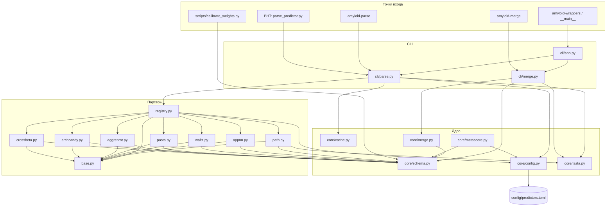

# amyloid_wrappers — обзор структуры и изменений

**Phase 0** — завершена (v0.2.0).  
**Phase 1** — базовая часть (PATH/APPNN runners); доработки ниже.  
**Phase 2–5** — в работе / запланированы.

---

## Phase 1 — кратко


| Изменение                  | Rationale                                                                                 |
| -------------------------- | ----------------------------------------------------------------------------------------- |
| `legacy/`                  | Копии BHT-скриптов внутри пакета                                                          |
| Единый wide-формат         | `position`, `aa_name`, `{Tool}_score/bin`                                                 |
| `runners/` + `amyloid-run` | PATH (`path1.1py`) и APPNN (Rscript) end-to-end; `--skip-run` для тестов без запуска PATH |
| `[runners.*]` в TOML       | Пути к внешним инструментам и timeout без правки кода                                     |


---


## 1. Дерево каталогов

```
amyloid_wrappers/
├── config/
│   └── predictors.toml          # веса, пороги, cache, runners
├── legacy/                      # frozen BHT reference scripts
│   ├── path_converter.py
│   ├── appnn_converter.R
│   ├── arch_cross_pasta_aggreprot_waltz_parser.ipynb
│   ├── parse_predictor.py
│   └── api/                     # Selenium runners (Phase 2–3)
├── scripts/
│   └── calibrate_weights.py
├── src/amyloid_wrappers/
│   ├── cli/                     # app, parse, merge, run
│   ├── core/
│   ├── predictors/
│   └── runners/                 # PATH, APPNN (Phase 1)
└── tests/
```


### Entry points (`pyproject.toml`)


| Команда                      | Модуль                     |
| ---------------------------- | -------------------------- |
| `amyloid-wrappers`           | `cli/app.py:main`          |
| `amyloid-parse`              | `cli/parse.py:main`        |
| `amyloid-merge`              | `cli/merge.py:main`        |
| `amyloid-run`                | `cli/run.py:main`          |
| `python -m amyloid_wrappers` | `__main__.py` → `app.main` |


---


## 2. Дерево зависимостей




### Типичный пайплайн данных

```
FASTA + raw output
    → amyloid-parse (cli/parse.py)
        → predictors/*.py → PredictorResult
        → standard CSV + cache/
    → amyloid-merge (cli/merge.py)
        → core/merge.py
        → wide merged CSV
    → (Phase 5) core/metascore.py + calibrate_weights.py
```

---


## 3. Происхождение кода (откуда взят)


| Модуль в `amyloid_wrappers`              | Источник в `BHT_amyloid/`                                                                                                                                 | Что перенесено                                                                       |
| ---------------------------------------- | --------------------------------------------------------------------------------------------------------------------------------------------------------- | ------------------------------------------------------------------------------------ |
| `predictors/waltz.py`                    | `arch_cross_pasta_aggreprot_waltz_parser.ipynb` → `analyze_output_waltz`                                                                                  | TSV `.dat`, берутся только бинарники по `score != 0`                                 |
| `predictors/pasta.py`                    | тот же notebook → `analyze_output_pasta`                                                                                                                  | энергии построчно, порог `< -5`                                                      |
| `predictors/aggreprot.py`                | notebook → `analyze_output_aggreprot`                                                                                                                     | CSV с `header=1`, drop лишних колонок, порог `≥ 0.25`                                |
| `predictors/archcandy.py`                | notebook → `analyze_output_archcandy`                                                                                                                     | регионы Start/Stop/Score → per-residue                                               |
| `predictors/crossbeta.py`                | notebook → `analyze_output_crossbeta`                                                                                                                     | JSON CRBM, `AA_list`, `mean_confidence`                                              |
| `predictors/path.py`                     | `path_converter.py` → `BatchPATHProcessor._load_path_results`, `_process_single_protein` (скользящее окно 6-mer, нормализация DOPE, percentile threshold) | **Только** per-residue score + bin; APR-экспорт и batch остались в legacy-скрипте   |
| `predictors/appnn.py`                    | `appnn_converter.R` (выходной CSV, не сам R-runner)                                                                                                       | колонки position/score/hotspot, порог 0.5                                            |
| `core/schema.py`                         | `all/RPS2_human_all.csv` и аналоги                                                                                                                        | имена колонок `{Tool}_score`, `{Tool}_bin`; `aggrescan` зарегистрирован, парсера нет |
| `core/merge.py`                          | `all/*_all.csv` + `all/visualize.py`                                                                                                                      | legacy: 0-based index, колонка `aa` = длина последовательности                       |
| `core/fasta.py`                          | `path_converter.py` → `FASTAParser.parse`                                                                                                                 | упрощённый парсер + валидация 20 стандартных а.к.                                    |
| `core/metascore.py`                      | `metascores/*_metascore_table.csv`                                                                                                                        | линейная взвешенная сумма (Phase 5)                                                  |
| `scripts/calibrate_weights.py`           | нет прямого аналога                                                                                                                                       | МНК (наименьшие квадраты) по `all/` vs `metascores/`                                 |
| `cli/parse.py`, `cli/merge.py`           | notebook (ручные вызовы) + ad-hoc скрипты                                                                                                                 | единый CLI                                                                           |
| `BHT_amyloid/scripts/parse_predictor.py` | notebook                                                                                                                                                  | thin wrapper → `amyloid-parse`                                                       |


### `legacy/`


| Файл                                          | Роль                        | Следующий шаг                                  |
| --------------------------------------------- | --------------------------- | ---------------------------------------------- |
| `legacy/api/aggreprot.py`                     | Selenium AggreProt          | `runners/aggreprot.py`                         |
| `legacy/api/cross_candy.py`                   | CRBM ArchCandy + Cross-Beta | `runners/archcandy.py`, `runners/crossbeta.py` |
| `legacy/api/PASTA 2.0.py`                     | PASTA web                   | `runners/pasta.py`                             |
| `legacy/path_converter.py`                    | APR/batch PATH export       | опционально: `amyloid-path-apr` CLI            |
| `BHT_amyloid/all/visualize.py`, `wilcoxon.py` | downstream                  | адаптация под wide CSV                         |


---


## 4. Функциональное назначение модулей


### CLI


| Файл           | Назначение                                                                                   |
| -------------- | -------------------------------------------------------------------------------------------- |
| `cli/app.py`   | Корневой вызов `--help`, использование функций нижнего уровня вида `parse` / `merge` / `run` |
| `cli/parse.py` | `amyloid-parse PREDICTOR` → standard CSV                                                     |
| `cli/merge.py` | `amyloid-merge`: standard CSV → wide table                                                   |
| `cli/run.py`   | `amyloid-run path                                                                            |


### Ядро (`core/`) - то есть скрипты, описывающие основные (базовые) классы для использования врапперов, базовые настройки, парсинг фаста файлов и пр.


| Файл           | Назначение                                                                                          |
| -------------- | --------------------------------------------------------------------------------------------------- |
| `schema.py`    | `PredictorSpec`, `PredictorResult`, реестр 8 предикторов, `read_standard_csv`, `binary_from_scores` |
| `config.py`    | `load_config()` из `predictors.toml`, `AMYLOID_WRAPPERS_CONFIG`                                     |
| `fasta.py`     | `read_fasta`, `read_first_sequence`, `STANDARD_AA`                                                  |
| `cache.py`     | копия raw в `cache/{protein_id}/{predictor}/raw.{ext}`                                              |
| `merge.py`     | объединение `PredictorResult` → wide CSV                                                            |
| `metascore.py` | `compute_weighted_metascore` — задел Phase 5, CLI пока нет                                          |


### Парсеры (`predictors/`)


| Модуль         | Raw input            | Standard output                                  |
| -------------- | -------------------- | ------------------------------------------------ |
| `path.py`      | PATH `results.csv`   | sliding window 6-mer, percentile bin             |
| `appnn.py`     | CSV после R          | score + hotspot / threshold                      |
| `waltz.py`     | `.dat` TSV           | score, bin если ≠ 0                              |
| `pasta.py`     | энергии построчно    | raw energy, bin `< threshold`                    |
| `aggreprot.py` | AggreProt CSV export | aggregation score                                |
| `archcandy.py` | region CSV           | max score по регионам                            |
| `crossbeta.py` | CRBM JSON            | mean_confidence per residue                      |
| `registry.py`  | —                    | `get_parser(name)`, подстановка kwargs из config |
| `base.py`      | —                    | ABC `BasePredictorParser.parse()`                |


### Конфиг и утилиты


| Файл                           | Назначение                              |
| ------------------------------ | --------------------------------------- |
| `config/predictors.toml`       | веса metascore (8×0.125), пороги, cache |
| `scripts/calibrate_weights.py` | подбор весов → фрагмент TOML для stdout |


### Тесты


| Файл               | Назначение                                        |
| ------------------ | ------------------------------------------------- |
| `test_parsers.py`  | unit-тесты каждого парсера                        |
| `test_golden.py`   | roundtrip vs `BHT_amyloid/all/RPS2_human_all.csv` |
| `test_cache.py`    | кэширование raw                                   |
| `test_cli_help.py` | smoke `--help`                                    |
| `test_runners.py`  | прогон PATH/APPNN без live run                    |


---


## 5. Единый формат выхода

Per-predictor и merged wide CSV:

```
position, aa_name, {Tool}_score, {Tool}_bin, ...
```

Исторический `*_all.csv` (колонка `aa` = длина, 0-based index) **больше не генерируется**.
Эталонные score-колонки из `BHT_amyloid/all/` по-прежнему совместимы по именам.

---


## 6. Краткая характеристика изменений и rationale


| Изменение                               | Зачем                                                                                                  |
| --------------------------------------- | ------------------------------------------------------------------------------------------------------ |
| **Вынос в installable package**         | один `pip install -e .`, воспроизводимость, pytest в conda env                                         |
| **Единая схема** `PredictorResult`      | все предикторы → одинаковые требования перед merge/metascore                                           |
| **Реестр колонок в** `schema.py`        | имена совпадают с `BHT_amyloid/all/*_all.csv`                                                          |
| **7 парсеров из notebook + PATH**       | notebook не автоматизируется; функции стали модулями с тестами                                         |
| **PATH: только per-residue slice**      | APR/batch/statistics остаются в `path_converter.py`; wrappers — слой совместимости                     |
| **PASTA: raw energy в standard CSV**    | в legacy могла быть нормализация; standard слой хранит физический смысл, bin — по порогу               |
| **Конфиг TOML**                         | пороги и веса без правки кода; `calibrate_weights.py` для подгонки                                     |
| **Raw cache**                           | воспроизводимость: что парсили, то и лежит в `cache/`                                                  |
| **CLI: parse / merge / run / wrappers** | единая точка входа; `--help` на всех уровнях                                                           |
| **Отказ от** `*_all.csv`                | один wide-формат; меньше путаницы с колонкой `aa`                                                      |
| `metascore.py` **без CLI**              | задел на внедрение прямого расчета метаскора; пока нефункциональна поскольку формула не прописана явно |
| `aggrescan`                             | подготовлен шаблон; пока нефукнционален из-за отсутствия самого парсера                                |
| **Golden tests**                        | регрессии при рефакторинге; эталон — реальные CSV из репозитория                                       |
| `parse_predictor.py` **в BHT**          | мягкая миграция: старый путь вызывает новый пакет                                                      |


---


## 7. План действий (актуально на v0.2.0)


### Текущее состояние


| Компонент                                                                | Статус                                                            |
| ------------------------------------------------------------------------ | ----------------------------------------------------------------- |
| 7 парсеров + merge + cache + config                                      | Готово                                                            |
| CLI: `amyloid-parse`, `amyloid-merge`, `amyloid-run`, `amyloid-wrappers` | Готово                                                            |
| Runners: PATH, APPNN                                                     | Готово                                                            |
| `legacy/` с BHT-скриптами                                                | Готово                                                            |
|                                                                          |                                                                   |
| Metascore CLI / batch pipeline                                           | В планах; скорее всего в самом конце                              |
| Web runners (WALTZ, PASTA, AggreProt, CRBM)                              | В планах как внедрение всех остальных врапперов                   |
| Aggrescan                                                                | Написание и внедрение отдельного враппера для данного инструмента |


### Целевой пайплайн

```
FASTA
  → amyloid-run / amyloid-parse (×8 predictors)
  → cache/{protein}/{tool}/raw.*
  → standard CSV per tool
  → amyloid-merge → wide CSV
  → amyloid-metascore (Phase 5) → metascore table
  → wilcoxon / visualize (адаптация BHT)
```

---


### Phase 1 — доработка PATH / APPNN (ближайшие шаги)


| #   | Задача                                                                                                   | Зачем                                     | Приоритет |
| --- | -------------------------------------------------------------------------------------------------------- | ----------------------------------------- | --------- |
|     |                                                                                                          |                                           |           |
| 1.1 | Документировать установку PATH ([repo](https://github.com/KubaWojciechowski/PATH)) и R `appnn`           | воспроизводимость интегрированных пакетов | высокий   |
| 1.3 | Прогон `amyloid-run appnn` на RPS2; `amyloid-run path --skip-run` + готовый `results.csv`                | валидация на реальных данных              | средний   |
| 1.4 | `build_all_table.py`: merge 7 CSV → wide, сравнение score-колонок с `BHT_amyloid/all/RPS2_human_all.csv` | регрессия после отказа от legacy скриптов | высокий   |
| 1.5 | Multifasta в APPNN runner (сейчас — первый белок в FASTA)                                                | дополнительная проверка фукнционала       | низкий    |
| 1.6 | Опционально: APR export из `legacy/path_converter.py` как отдельная команда                              | биологический анализ регионов             | низкий    |


---


### Phase 2 — локальные / файловые runners


| #   | Предиктор             | Источник                       | Runner                                                    |
| --- | --------------------- | ------------------------------ | --------------------------------------------------------- |
| 2.1 | WALTZ                 | локальный `.dat` или CLI WALTZ | `runners/waltz.py` — если есть бинарник; иначе parse-only |
| 2.2 | Общий `BaseWebRunner` | `legacy/api/*.py`              | Selenium + download + cache                               |


Зависимости: `selenium`, `webdriver-manager` — опционально в `pyproject.toml`.

---


### Phase 3 — web runners (Selenium)

Порядок по простоте API в `legacy/api/`:


| #   | Предиктор  | Legacy                      | Задача                            |
| --- | ---------- | --------------------------- | --------------------------------- |
| 3.1 | AggreProt  | `legacy/api/aggreprot.py`   | `amyloid-run aggreprot --fasta …` |
| 3.2 | ArchCandy  | `legacy/api/cross_candy.py` | upload FASTA → CSV regions        |
| 3.3 | Cross-Beta | тот же скрипт               | JSON → уже есть parser            |
| 3.4 | PASTA 2.0  | `legacy/api/PASTA 2.0.py`   | tar/energy file → parser          |


После каждого runner: unit-тест с fixture + `--skip-run` smoke.

---

### Phase 4 — Aggrescan


| #   | Задача                                                      |
| --- | ----------------------------------------------------------- |
| 4.1 | Уточнить raw-формат Aggrescan в `BHT_amyloid/all/*_all.csv` |
| 4.2 | `predictors/aggrescan.py` + регистрация в `registry.py`     |
| 4.3 | Runner (если есть локальный инструмент или web)             |


---

### Phase 5 — Metascore и batch orchestration


| #   | Задача                                                                            | Модуль               |
| --- | --------------------------------------------------------------------------------- | -------------------- |
| 5.1 | `amyloid-metascore` CLI                                                           | `cli/metascore.py`   |
| 5.2 | Прогон `calibrate_weights.py` на RPS2 wide merge → обновить `[metascore.weights]` | `scripts/`           |
| 5.3 | Восстановить/задокументировать формулу metascore из hackathon                     | README + tests       |
| 5.4 | `amyloid-batch` (или Makefile): FASTA → all predictors → merge → metascore        | `cli/batch.py`       |
| 5.5 | CI: `python -m pytest` на GitHub Actions (без live PATH)                          | `.github/workflows/` |


---

### Инфраструктура и качество


| #   | Задача                                                                           |
| --- | -------------------------------------------------------------------------------- |
| I.1 | Тестовые fixtures в репо (`tests/fixtures/RPS2_*`) — golden без `../BHT_amyloid` |
| I.2 | Адаптировать `BHT_amyloid/all/visualize.py` под wide CSV (или wrapper-скрипт)    |
| I.3 | `ruff` / pre-commit (уже в `[dev]` extras)                                       |
| I.4 | Версионирование: tag `v0.2.0` после push                                         |


